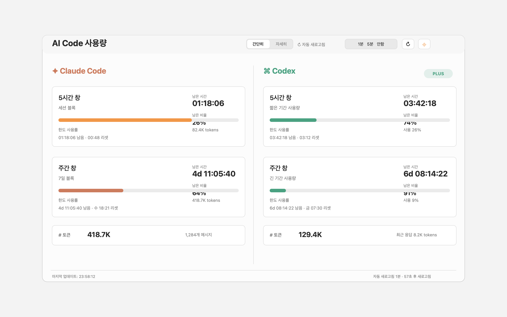

# TokenScope

TokenScope는 Claude Code와 Codex의 사용량을 한 화면에서 확인하는 macOS 데스크탑 앱입니다.

Claude Code와 Codex를 함께 사용하다 보면 각 도구의 사용량, 남은 시간, 주간 한도, 토큰 사용량을 따로 확인해야 합니다. TokenScope는 OAuth usage API, statusline/ccusage 캐시, 로컬 로그를 우선순위에 따라 읽어 공통 포맷으로 정리하고, 왼쪽에는 Claude Code, 오른쪽에는 Codex 정보를 나란히 보여줍니다.



## 주요 기능

- Claude Code와 Codex 사용량을 좌우 2컬럼으로 표시
- 5시간 창과 주간 창의 남은 시간, 남은 비율, 진행률 표시
- Claude Code와 Codex의 토큰 사용량 요약
- `간단히` / `자세히` 보기 모드
- 자동 새로고침 `1분` / `5분` / `안함` 선택
- 다음 자동 새로고침까지 남은 초 표시
- 항상 위 토글
- 메뉴바 항목 제공
- 보기 모드, 자동 새로고침 설정, 항상 위 상태, 창 크기 저장

## 작동 방식

TokenScope는 Codex와 Claude Code의 사용량을 같은 화면 구조로 보여주기 위해 서비스별로 가장 신뢰도 높은 데이터 소스를 먼저 사용하고, 실패하면 단계적으로 fallback합니다.

### Claude Code

Claude Code는 다음 우선순위로 사용량을 읽습니다.

1. `OAUTH`: Claude Code가 macOS Keychain에 저장한 OAuth 토큰으로 Anthropic OAuth usage API 조회
2. `STATUSLINE`: Claude Code statusline JSON을 TokenScope 캐시 파일로 저장한 값
3. `CCUSAGE`: `ccusage`가 생성한 `~/.claude/usage-limits.json` 캐시
4. 로컬 추정: `~/.claude/projects/**/*.jsonl` assistant message의 `usage` 필드 기반

사용하는 로컬 파일:

```text
~/.claude/projects/**/*.jsonl
~/.claude/token-scope-oauth-usage.json
~/.claude/token-scope-oauth-failure.json
~/.claude/token-scope-status.json
~/.claude/usage-limits.json
```

OAuth API 방식은 so-agentbar의 구현 방식을 참고했습니다. TokenScope는 `/usr/bin/security` CLI로 Keychain의 `Claude Code-credentials` 항목을 읽고, 그 안의 `claudeAiOauth.accessToken`을 사용합니다. 토큰 값은 화면이나 로그에 출력하지 않습니다.
OAuth API rate limit을 피하기 위해 성공한 응답은 `~/.claude/token-scope-oauth-usage.json`에 캐시합니다. 5분 이내의 캐시는 네트워크 호출 없이 사용합니다. API가 429 등으로 실패하면 `~/.claude/token-scope-oauth-failure.json`에 실패 시각을 기록하고 5분 뒤 다시 OAuth API를 호출합니다. 실패 중에는 최근 30분 OAuth 캐시까지 fallback으로 사용하며, 실패 상태와 재시도까지 남은 시간은 하단 status bar에 표시합니다. 사용자가 새로고침 버튼이나 메뉴바 새로고침을 직접 누른 경우에는 실패 재시도 대기 중이어도 OAuth API를 즉시 다시 호출합니다.

조회하는 Anthropic OAuth API:

```text
GET https://api.anthropic.com/api/oauth/usage
GET https://api.anthropic.com/api/oauth/account
Authorization: Bearer <Claude Code OAuth access token>
anthropic-beta: oauth-2025-04-20
```

`usage` 응답에서 다음 값을 읽습니다.

- `five_hour.utilization`
- `five_hour.resets_at`
- `seven_day.utilization`
- `seven_day.resets_at`
- `extra_usage`

`account` 응답에서는 가능한 경우 플랜명을 추정합니다.

Claude 상세 보기의 pie chart는 서버에서 받은 값 기준으로 구성됩니다.

- 남은 사용량: `100 - utilization`
- 남은 시간: `resets_at - 현재 시각`을 5시간 또는 7일 창 길이로 나눈 값

기존 Claude Code statusline 스크립트가 있다면, stdin JSON을 읽은 직후 다음처럼 TokenScope 캐시를 갱신할 수 있습니다.

```bash
printf '%s' "$input" | /path/to/token-scape/scripts/claude-statusline-cache.sh >/dev/null
```

캐시 저장 위치를 바꾸려면 `TOKEN_SCOPE_STATUSLINE_CACHE` 환경변수를 설정하세요.

### Codex

Codex는 로컬 세션 로그의 최신 `rate_limits` 이벤트와 `token_count` 정보를 읽습니다.

```text
~/.codex/sessions/**/*.jsonl
```

## 화면 구성

왼쪽 컬럼은 Claude Code, 오른쪽 컬럼은 Codex입니다. 두 컬럼은 가능한 한 같은 위치에 같은 의미의 정보를 표시합니다.

- 카드 오른쪽 상단 첫 번째 값: `남은 시간`
- 카드 오른쪽 상단 두 번째 값: `남은 비율`
- 5시간 창 남은 시간: `HH:MM:SS`
- 주간 창 남은 시간: `6d HH:MM:SS`

서비스별 하이라이트 색상도 분리했습니다.

- Claude Code: Claude 계열의 따뜻한 오렌지
- Codex: OpenAI/Codex 계열의 녹색

Claude Code 카드에는 사용량 출처를 표시합니다.

- `OAUTH`: Claude Code Keychain OAuth 토큰 기반 Anthropic usage API
- `STATUSLINE`: Claude Code statusline JSON 기반 rate limit cache
- `CCUSAGE`: `~/.claude/usage-limits.json` 기반 실제 usage cache
- 출처 배지가 없고 `블록 잔여`로 표시되는 경우: 로컬 JSONL 로그 기반 추정

## 설치 및 실행

요구사항:

- macOS 14 이상
- Swift 6 toolchain 또는 Xcode Command Line Tools

실행:

```sh
make run
```

앱 번들 생성:

```sh
make app
open .build/release/TokenScope.app
```

테스트 또는 컴파일 확인:

```sh
make test
```

`make test`는 XCTest 없이 동작하는 `UsageTests` executable test runner를 실행합니다.

## 메뉴바

앱은 메뉴바 항목을 제공합니다.

- Codex 남은 비율 표시
- Codex 정보가 없으면 Claude 5시간 창 남은 시간 표시
- 둘 다 없으면 `Usage --` 표시
- 창 열기
- 새로고침
- 종료

## 아키텍처

프로젝트는 작은 hexagonal architecture 기반으로 구성되어 있습니다.

- `Sources/CodexUsageCore/Domain`: 사용량 snapshot과 dashboard state
- `Sources/CodexUsageCore/Ports`: `CodexUsageReading`, `ClaudeUsageReading`, `DateProviding`
- `Sources/CodexUsageCore/UseCases`: 사용량 dashboard 로드 use case
- `Sources/CodexUsageCore/Adapters/LocalLogs`: 로컬 JSONL 로그 reader, Claude OAuth/statusline/ccusage cache reader
- `Sources/TokenScope`: SwiftUI/AppKit UI, 메뉴바, refresh scheduler, formatting, 사용자 설정 저장

SwiftUI 화면은 로그 파일을 직접 파싱하지 않습니다. UI는 use case를 호출하고, use case는 port에 의존하며, 로컬 로그 reader는 교체 가능한 outbound adapter로 분리되어 있습니다.

## 참고 자료

Claude Code 사용량을 더 정확하게 표시하기 위해 다음 자료와 프로젝트를 참고했습니다.

- [so-agentbar](https://github.com/sotthang/so-agentbar): Claude Code Keychain OAuth 토큰을 읽고 Anthropic OAuth usage/account API를 호출하는 방식을 참고했습니다.
- [ccusage](https://ccusage.com/): Claude Code usage limit 캐시 파일인 `~/.claude/usage-limits.json` 활용 방식을 참고했습니다.
- [Claude-Code-Usage-Monitor](https://github.com/Maciek-roboblog/Claude-Code-Usage-Monitor): `~/.claude/projects` JSONL 로그를 읽어 5시간 세션 블록과 로컬 사용량을 추정하는 fallback 접근을 참고했습니다.
- [사용자 statusline 예시](https://github.com/yoophi/.dotfiles/blob/master/.claude/statusline.sh): Claude Code statusline stdin JSON의 `rate_limits`와 `context_window` 필드 활용 방식을 참고했습니다.
- [TokenScope 이슈 #1](https://github.com/yoophi/token-scape/issues/1): Claude Code 사용 리미트의 정확한 정보 제공을 위한 조사와 개선 내역을 정리했습니다.

## 검증 명령

변경 후 다음 명령으로 앱을 확인합니다.

```sh
make test
make app
plutil -lint .build/release/TokenScope.app/Contents/Info.plist
open .build/release/TokenScope.app
```
